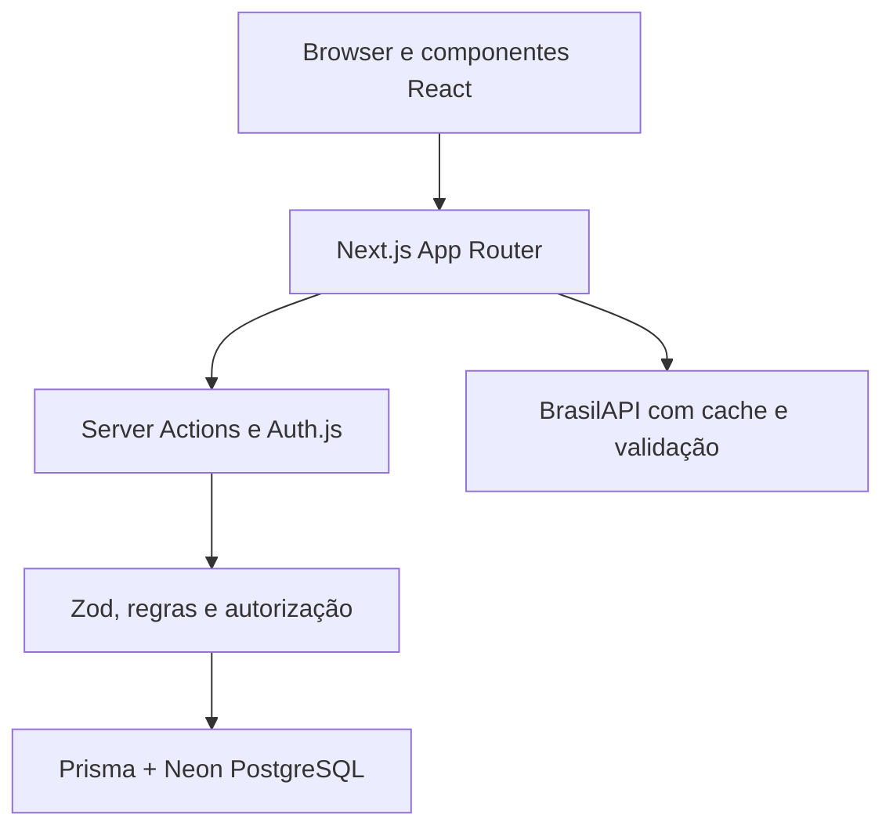

# TaskFlow

[](https://github.com/jorge-pires/projeto-kanban/actions/workflows/ci.yml)
[](https://github.com/jorge-pires/projeto-kanban/actions/workflows/security.yml)
[](LICENSE)

TaskFlow é uma aplicação full-stack de gerenciamento de projetos e tarefas em
quadros Kanban. O projeto demonstra fundamentos esperados de uma pessoa
desenvolvedora Frontend Júnior: interface responsiva, acessibilidade, estado
interativo, integração com API, autenticação, persistência, testes e CI.

**Demonstração:** [projeto-kanban-pi.vercel.app](https://projeto-kanban-pi.vercel.app)

## Funcionalidades

- cadastro e login com sessão protegida;
- projetos isolados por proprietário;
- criação, edição e exclusão de tarefas;
- Kanban com drag-and-drop por mouse, toque ou teclado;
- busca, filtro por prioridade e ordenação por prazo;
- dashboard com progresso, tarefas atrasadas e atividade recente;
- calendário de tarefas e feriados nacionais da BrasilAPI;
- perfil do usuário;
- navegação mobile-first, skip link e suporte a movimento reduzido;
- estados de carregamento, páginas 404 e limites de erro.

## Tecnologias

| Tecnologia               | Papel no projeto                                             |
| ------------------------ | ------------------------------------------------------------ |
| Next.js 16               | Rotas, Server Components, Server Actions e build de produção |
| React 19                 | Componentes e interações da interface                        |
| TypeScript               | Tipagem estática e contratos entre arquivos                  |
| Tailwind CSS 4           | Estilos mobile-first e design responsivo                     |
| Auth.js                  | Sessões JWT e autenticação por credenciais                   |
| Prisma ORM 7             | Consultas tipadas e migrações do banco                       |
| Neon PostgreSQL          | Banco serverless persistente com conexão TLS e pooling       |
| Zod                      | Validação de formulários, ambiente e respostas externas      |
| dnd-kit                  | Drag-and-drop acessível por diferentes dispositivos          |
| Vitest + Testing Library | Testes unitários e testes de componentes                     |
| GitHub Actions           | Lint, tipos, testes, build e análise de segurança            |

Todas as ferramentas usadas possuem opção gratuita adequada para estudo e
portfólio.

## Arquitetura



- Páginas são Server Components por padrão, reduzindo JavaScript no navegador.
- Componentes recebem `"use client"` somente quando precisam de estado,
  eventos ou APIs do browser.
- Toda mutação é novamente validada e autorizada no servidor.
- Regras do Kanban ficam em funções puras em `lib/tasks`, independentes da UI.
- Respostas da BrasilAPI são validadas antes de chegarem à página.

Veja [a documentação de arquitetura](docs/architecture.md) para o fluxo
detalhado.

## Segurança

- senhas armazenadas somente como hash bcrypt com salt;
- sessões assinadas por segredo externo ao código;
- consultas e mutações filtradas pelo usuário autenticado;
- limites de tentativas de login e cadastro;
- IP usado no limite é transformado em HMAC antes de ser persistido;
- Content Security Policy e cabeçalhos HTTP defensivos;
- validação de entrada no servidor e restrições de integridade no PostgreSQL;
- TLS entre cliente, Vercel e Neon;
- Dependabot, auditoria de dependências com `npm audit` e CodeQL.

Segurança é um processo contínuo, não uma garantia absoluta. Consulte
[SECURITY.md](SECURITY.md) para relatar vulnerabilidades.

## Testes e qualidade

A suíte cobre validações, calendário, filtros, ordenação, drag-and-drop,
rate limiting, leitura segura de IP e interações críticas de navegação.
As métricas de cobertura são aplicadas aos módulos de regra e componentes
críticos; componentes puramente visuais são verificados por lint, tipos e
revisão da interface em vez de testes frágeis de marcação.

```bash
npm test
npm run test:coverage
npm run lint
npm run typecheck
npm run build
```

O CI executa todas essas verificações em cada pull request para `main`.

## Executar localmente

### Pré-requisitos

- Node.js 22;
- npm 11;
- uma conta gratuita no [Neon](https://neon.com/).

### Instalação

```bash
git clone https://github.com/jorge-pires/projeto-kanban.git
cd projeto-kanban
npm ci
cp .env.example .env
```

No Neon, crie um projeto e preencha `.env`:

```dotenv
DATABASE_URL="postgresql://...-pooler.../taskflow?sslmode=require"
DIRECT_URL="postgresql://.../taskflow?sslmode=require"
AUTH_SECRET="gere-um-valor-aleatorio-com-pelo-menos-32-caracteres"
```

Gere o segredo e prepare o banco:

```bash
npx auth secret
npm run db:deploy
npm run dev
```

Acesse `http://localhost:3000`.

> Nunca envie o arquivo `.env` ao GitHub. Apenas `.env.example` deve ser
> versionado.

## Scripts

| Comando                 | O que faz                                        |
| ----------------------- | ------------------------------------------------ |
| `npm run dev`           | inicia o ambiente local com Turbopack            |
| `npm run check`         | executa lint, TypeScript e testes                |
| `npm run test:coverage` | gera o relatório de cobertura                    |
| `npm run format`        | formata arquivos com Prettier                    |
| `npm run build`         | cria o build otimizado de produção               |
| `npm run db:migrate`    | cria/aplica uma migração durante desenvolvimento |
| `npm run db:deploy`     | aplica migrações existentes em produção          |

## Estrutura principal

```text
app/                 rotas, layouts e Server Actions
components/          componentes de interface
data/                conteúdo estático e navegação
lib/security/        proteção de autenticação
lib/services/        clientes de APIs externas
lib/tasks/           regras puras do Kanban
lib/validations/     schemas Zod
prisma/              schema e migrações PostgreSQL
docs/                arquitetura, deploy e fluxo com IA
```

## Decisões técnicas

- PostgreSQL substitui SQLite porque a aplicação é hospedada em ambiente
  serverless e precisa de persistência externa.
- O estado do drag-and-drop é atualizado de forma otimista; se a gravação
  falhar, a interface retorna ao estado anterior.
- Testes E2E não foram adicionados neste estágio para manter CI rápido e barato.
  As regras de maior risco são cobertas por testes unitários e de componentes.
- A API de feriados usa cache de 24 horas para reduzir latência e chamadas.

## Autor

Desenvolvido por [Jorge Pires](https://github.com/jorge-pires) como projeto de
portfólio para uma primeira oportunidade em desenvolvimento Frontend.

## Licença

Distribuído sob a [licença MIT](LICENSE).
