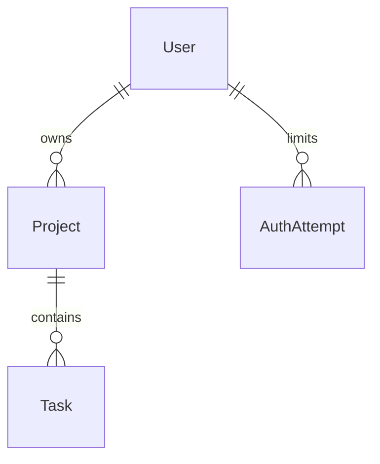

# Architecture

## Request flow

1. The browser requests a route from the Next.js App Router.
2. A Server Component loads the authenticated session when the route is private.
3. Prisma queries only records owned by `session.user.id`.
4. Interactive components receive the minimum serializable data they need.
5. Forms call Server Actions, which repeat authentication, authorization and
   Zod validation before writing.
6. The affected routes are revalidated after a successful mutation.

## Boundaries

### Presentation

`components/` contains visual rendering and browser events. Client Components
must not contain credentials or act as the only validation layer.

### Application

`app/` connects routes, sessions, data queries and Server Actions. Server
Actions are treated as public HTTP entry points even when called by an internal
form.

### Domain

`lib/tasks/board.ts` owns framework-independent filter, sort, move and position
rules. Keeping these functions pure makes edge cases fast to test.

### Infrastructure

`lib/prisma.ts` is the single Prisma Client entry point. It uses the Neon driver
adapter and a pooled runtime URL. `prisma.config.ts` uses the direct URL for
migrations.

`lib/services/holidays.ts` is the BrasilAPI boundary. It applies a five-second
timeout and safe fallback, validates unknown JSON with Zod and caches successful
Next.js requests for 24 hours.

## Data ownership

Cascade deletion removes dependent projects, tasks and authentication attempt
records. Database checks reject unsupported task statuses, priorities, project
colors and negative positions.

## Authentication

- Auth.js uses a credentials provider and an eight-hour signed JWT session.
- bcrypt compares password hashes with cost factor 12.
- A dummy hash comparison reduces timing differences for unknown accounts.
- Login and registration attempts are limited by an HMAC of the client address;
  raw addresses are not stored.

## Performance

- Server Components avoid shipping data-fetching code to the browser.
- Dashboard queries run concurrently and select scoped records.
- The Prisma Client is reused during development.
- Neon pooling prevents one database connection per serverless request.
- BrasilAPI responses use Next.js revalidation instead of repeated calls.
- Search uses `useDeferredValue` so typing remains responsive on larger boards.

## Testing strategy

- Unit tests: schemas, security helpers, API parsing and Kanban rules.
- Component tests: important semantics, filters, navigation and focus behavior.
- CI: formatting, ESLint, TypeScript, migrations, coverage and production build.
- E2E can be introduced when multi-browser workflows justify its CI cost.
